# QuestForge 🚀

QuestForge is a state-of-the-art digital gaming marketplace and interactive catalog registry built for completionists, reviewers, and collectors.

---

## ⚡ Live Link
- **URL**: _(Coming Soon)_

---

## 📖 Project Purpose & Description
QuestForge serves as a unified ecosystem for players and creators alike. It allows players to search for hot gaming releases, catalog their interactive quests, post reviews, manage wishlists, and store game credentials in a personal inventory vault. For creators, it acts as a publishing registry to list new titles, manage keys, and track community interactions.

---

## 🌟 Key Features
- **Adventure Realms Categorisation**: Dynamic genre discovery panels allowing users to browse realms based on specific tags and themes.
- **Featured Releases**: Curated carousel and limited marketplace cards showcasing trending games from the database.
- **Digital Vault Inventory (Gaming Bucket)**: Secure storage drawer for user licensing keys, vault listings, and interactive wishlists.
- **Google OAuth & Native Auth**: Social provider sign-in integration powered by Better Auth.
- **Merchant Listings & Key Distribution**: Seamless game publishing form with real-time base64 image uploads and key distribution utilities.
- **Modern Responsive Design**: Centered mobile layouts, consistent branding gradients, animations, and glowing glassmorphism theme states.

---

## 🛠️ Technology Stack
- **Frontend Core**: React 19, Next.js 15 (App Router), TypeScript
- **Styling**: TailwindCSS, CSS Variables, Ambient Glow layers
- **Authentication**: Better Auth (Email & Password, Google OAuth Social Provider)
- **Database Layer**: MongoDB, Mongoose adapter
- **UI Components & Icons**: HeroUI, Gravity UI Icons
- **Image Hosting**: ImgBB API Integration
- **Server Environment**: Node.js, Express, TypeScript (separate backend service)
